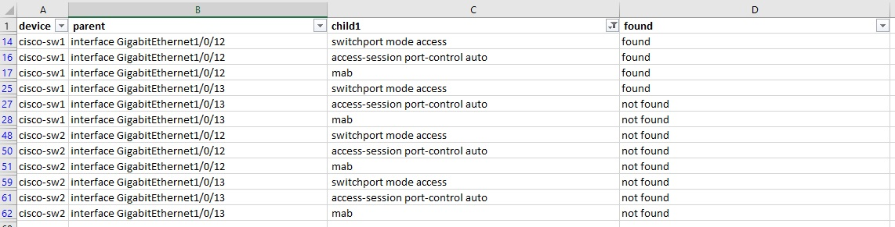

# cisco-validation-tool

This tool was meant to help validate some Cisco ISE specific configurations. It uses a file called "golden.ini" where you can put global or interface "golden" parameters. The script than uses ciscoconfparse to search for the golden lines and report whether they are found or not.

## Usage

```
$ python config-validator.py
```

## Output

Output is written to a CSV file where you can sort and filter using Excel or some other editor.

</img>

## Filter interfaces

In the script you can filter the interface. Below we are only getting the 12th-13th interfaces which happen to be g1/0/12-13.

```
    # FILTER INTERFACE LIST
    #interface_list = [i.text for i in interfaces]
    interface_list = [i.text for i in interfaces][12:14]
```
## Future

- Add netmiko support (Currently just searches local dir for conf files)
- Add option to create a Cisco config script to add in the "not founds"

